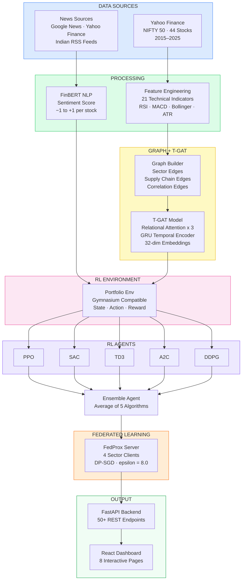
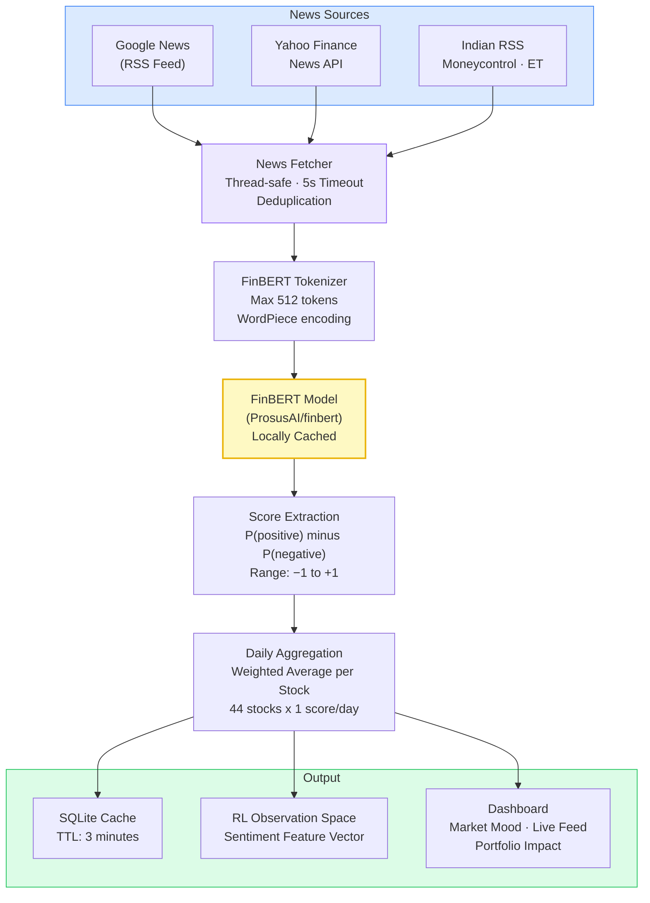
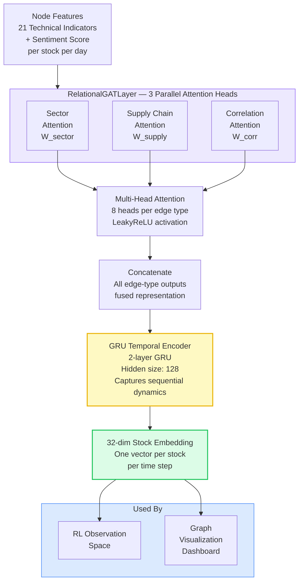
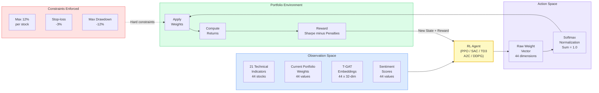
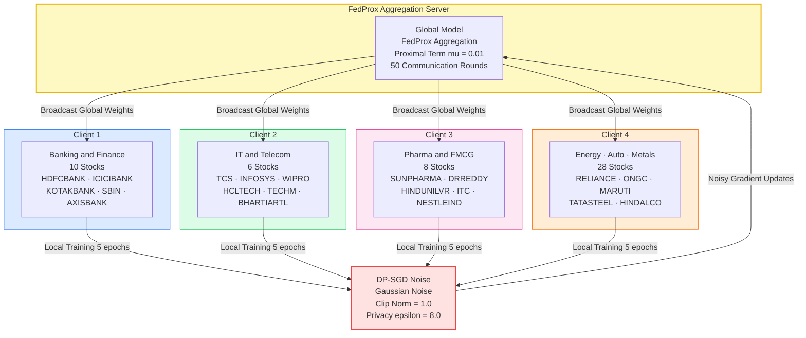

# Dissertation Diagrams — Mermaid Source Code
## How to use: Go to https://mermaid.live, paste code, screenshot

---

## DIAGRAM 1 — fig_3_1_architecture.png
## System Architecture (Chapter 3.1)

---

## DIAGRAM 2 — fig_3_4_sentiment_pipeline.png
## FinBERT Sentiment Pipeline (Chapter 3.5)

---

## DIAGRAM 3 — fig_3_6_tgat.png
## T-GAT Architecture (Chapter 3.7)

---

## DIAGRAM 4 — fig_3_7_rl_env.png
## RL Environment Cycle (Chapter 3.8)

---

## DIAGRAM 5 — fig_3_8_fl.png
## Federated Learning System (Chapter 3.11)

---

## File Names to Save As
- Diagram 1: fqn1/disst/imgs/fig_3_1_architecture.png
- Diagram 2: fqn1/disst/imgs/fig_3_4_sentiment_pipeline.png
- Diagram 3: fqn1/disst/imgs/fig_3_6_tgat.png
- Diagram 4: fqn1/disst/imgs/fig_3_7_rl_env.png
- Diagram 5: fqn1/disst/imgs/fig_3_8_fl.png
