```mermaid
---
config:
  theme: base
  themeVariables:
    primaryColor: "#dbeafe"
    primaryTextColor: "#1e3a5f"
    primaryBorderColor: "#3b82f6"
    lineColor: "#64748b"
    fontSize: "14px"
---
flowchart TD

    %% ── LAYER 1: ENDPOINT SENSOR ──────────────────────────────
    subgraph EP["⬛ Layer 1 · Endpoint Sensor  (Windows Agent — Rust Service)"]
        direction TB

        subgraph COLL["Telemetry Collectors  (ETW — user-mode, no driver)"]
            direction LR
            PROC["Process Monitor\nPID · PPID · cmdline\nintegrity level · user"]
            FILE["File Monitor\ncreate / modify / delete\nSHA-256 on write"]
            NET["Network Monitor\nsrc/dst IP · port · DNS\nETW Kernel-Network"]
            REG["Registry Monitor\nRun keys · Services\npath · value · data"]
        end

        subgraph LOCAL["On-Sensor Detection  (real-time, no network needed)"]
            direction LR
            RANSOM["Ransomware Detector\n· files/sec threshold\n· high-entropy writes\n· extension churn\n→ immediate BLOCK"]
            BLOOM["Bloom Filter  (~1.2 MB)\n· 1 M+ malware hashes\n· 1% false-positive rate\nNO → clean\nYES → cloud lookup"]
            YARA["YARA Scanner  (~150 KB)\n· compiled .yrc rules\n· scans on write event\n· scheduled full-disk scan"]
            ANOMALY["Anomaly Pre-filter\n· suppress known-good\n· rate-limit noisy events\n→ ~60% backend load cut"]
        end

        CORE["Agent Core\nWindows Service skeleton · ETW session manager\nwatchdog · config & policy receiver"]
        BATCH["Event Batcher\nbuffer 500 events OR 5 s · zstd compression\nsequence numbering · disk-persist on disconnect"]
        RESPONDER["Response Executor\nisolate NIC · kill PID\non-demand scan · policy push"]
    end

    %% ── LAYER 2: TRANSPORT ────────────────────────────────────
    subgraph TRANS["🔒 Layer 2 · Secure Transport"]
        GRPC["gRPC + mTLS\nmutual cert auth · per-tenant client cert\nbidirectional stream  ─  events ↑  commands ↓\nreconnect + exponential backoff"]
    end

    %% ── LAYER 3: BACKEND ──────────────────────────────────────
    subgraph BACK["☁️ Layer 3 · Tenant Backend  (Actix-Web / FastAPI)"]
        direction TB
        API["API Gateway\nagent registration · event ingest\ncommand dispatch · health + heartbeat"]

        subgraph PIPE["Event Processing Pipeline"]
            direction LR
            INGEST["Ingest\nschema validate\ndedup · tenant check"]
            NORM["Normalize\nECS field mapping\nUTC timestamps\nprocess-tree link"]
            ENRICH["Enrich\nhostname → IP\nMITRE technique ID\nhash threat-intel lookup\nparent-child chain"]
        end

        SIGDIST["Signature Distribution  (pull model — agent polls)\nagent sends bloom_version + yara_version on heartbeat\n→ Bloom: push full .bloom (~1.2 MB) if stale\n→ YARA: push only changed .yrc delta files\natomic swap on agent — no restart · rollback supported"]
    end

    %% ── LAYER 4: DETECTION ENGINE ─────────────────────────────
    subgraph DET["🎯 Layer 4 · Detection Engine"]
        direction LR
        SIGMA["Rule Engine\nSigma/YAML loader\n30–40 rules at MVP\nfield-match + condition eval\nMITRE tag per rule"]
        BEH["Behavioral Engine\nprocess-chain analysis\nOffice→shell detection\nrecon burst detection\nlateral movement patterns"]
        ALERTMGR["Alert Manager\ndedup (same alert 10 min)\nseverity assignment\nMITRE ATT&CK mapping\n→ write to OpenSearch"]
    end

    %% ── LAYER 5: AV BACKEND ───────────────────────────────────
    subgraph AVBACK["🛡️ Layer 5 · AV Backend Engine  (DB lives here — NOT on endpoint)"]
        direction LR
        SIG_DB[("Full Hash DB\nOpenSearch index\n1 M+ malware SHA-256s\nMalwareBazaar · VirusTotal\nCISA daily feeds")]
        BLOOM_B[("Bloom Filter Builder\nnightly cron\nreads SIG_DB → .bloom\n~1.2 MB · versioned\nchecksummed")]
        YARA_DB[("YARA Rule Store\nraw .yar source  (SOC edits)\ncompiled → .yrc server-side\nversioned · delta-packaged\nrollback supported")]
    end

    %% ── LAYER 6: STORAGE ──────────────────────────────────────
    subgraph STORE["💾 Layer 6 · Storage  (OpenSearch Cluster)"]
        direction LR
        EVT[("events-*\nAll raw telemetry\nhot 7d → warm 30d\n→ delete at 90d")]
        ALT[("alerts-*\nGenerated alerts\nstatus · assignee · notes\nretained 1 year")]
        EPS[("endpoints-*\nAgent inventory\nlast-seen · version\npolicy · health")]
        SIGIDX[("signatures-*\nMalware hash DB\nYARA rule store")]
    end

    %% ── LAYER 7: CONSOLE ──────────────────────────────────────
    subgraph CON["🖥️ Layer 7 · Central Console  (React — per-tenant SaaS)"]
        direction LR
        DASH["Dashboard\nlive endpoint count\nalert trend 24h / 7d\ntop attacked endpoints"]
        ALERTV["Alert Console\nalert queue · severity filter\ntriage: open→in-progress→closed\nMITRE badge · analyst assign"]
        TL["Endpoint Timeline\nper-endpoint event history\nprocess tree visualisation\npivot: click PID → all events"]
        HUNT["Threat Hunting\nraw OpenSearch query UI\nsaved query library\ncross-endpoint search · CSV export"]
        RESP["Response Actions\nisolate endpoint (block NIC)\nkill process by PID\ntrigger on-demand AV scan\npush policy / rule update"]
    end

    %% ── DATA FLOWS ────────────────────────────────────────────

    %% Sensor → core → batch → transport
    PROC & FILE & NET & REG --> CORE
    RANSOM & BLOOM & YARA & ANOMALY --> CORE
    CORE --> BATCH
    BATCH --> GRPC

    %% Transport → backend
    GRPC --> API
    API --> INGEST --> NORM --> ENRICH

    %% Enriched → detection
    ENRICH --> SIGMA & BEH
    SIGMA & BEH --> ALERTMGR

    %% Storage writes
    ENRICH --> EVT
    ALERTMGR --> ALT
    API --> EPS
    SIG_DB --> SIGIDX
    YARA_DB --> SIGIDX

    %% AV backend build pipeline
    SIG_DB -->|nightly rebuild| BLOOM_B
    SIG_DB -.->|definitive hash lookup| BLOOM
    BLOOM_B -.->|version check → push .bloom| SIGDIST
    YARA_DB -.->|compile + delta package| SIGDIST
    SIGDIST -.->|atomic swap on heartbeat| BLOOM
    SIGDIST -.->|delta .yrc rules only| YARA

    %% Console reads storage
    EVT --> TL & HUNT
    ALT --> ALERTV
    EPS & EVT & ALT --> DASH

    %% Response reverse flow
    RESP -->|REST command| API
    API -->|dispatch| GRPC
    GRPC -->|Isolate · Kill · Scan| RESPONDER

    %% ── STYLES ────────────────────────────────────────────────
    classDef sensor    fill:#dbeafe,stroke:#1d4ed8,stroke-width:2px,color:#1e3a5f
    classDef localdet  fill:#fce7f3,stroke:#be185d,stroke-width:1.5px,color:#500724
    classDef transport fill:#fef9c3,stroke:#ca8a04,stroke-width:2px,color:#422006
    classDef backend   fill:#dcfce7,stroke:#15803d,stroke-width:2px,color:#052e16
    classDef detection fill:#f3e8ff,stroke:#7e22ce,stroke-width:2px,color:#2e1065
    classDef avback    fill:#ffedd5,stroke:#c2410c,stroke-width:1.5px,color:#431407
    classDef storage   fill:#ede9fe,stroke:#5b21b6,stroke-width:2px,color:#1e0752
    classDef console   fill:#ccfbf1,stroke:#0f766e,stroke-width:2px,color:#022c22

    class PROC,FILE,NET,REG,CORE,BATCH,RESPONDER sensor
    class RANSOM,BLOOM,YARA,ANOMALY localdet
    class GRPC transport
    class API,INGEST,NORM,ENRICH,SIGDIST backend
    class SIGMA,BEH,ALERTMGR detection
    class SIG_DB,BLOOM_B,YARA_DB avback
    class EVT,ALT,EPS,SIGIDX storage
    class DASH,ALERTV,TL,HUNT,RESP console
```

# System Architecture — FINQUANT-NEXUS v4
## Endpoint Detection & Response (EDR) Platform

---

---

## Architecture Summary

| Layer | Component | Technology |
|-------|-----------|------------|
| 1 | Endpoint Sensor | Rust Windows Service, ETW |
| 2 | Secure Transport | gRPC + mTLS |
| 3 | Tenant Backend | Actix-Web / FastAPI |
| 4 | Detection Engine | Sigma Rules, Behavioral Analysis |
| 5 | AV Backend Engine | OpenSearch, Bloom Filter, YARA |
| 6 | Storage | OpenSearch Cluster (ILM) |
| 7 | Central Console | React (SaaS, per-tenant) |

**Key Design Decisions:**
- Full malware DB stays on server; endpoint holds only a 1.2 MB Bloom filter
- ~60% backend load reduction via on-sensor anomaly pre-filtering
- Bidirectional gRPC stream handles telemetry upload and command push simultaneously
- Signature updates use a pull/delta model — no agent restart required
